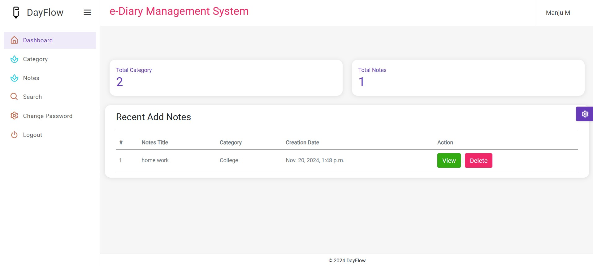

# E-Diary Management System

E-Diary Management System is a web-based application built using Django. It allows users to securely create, edit, and manage their personal notes or diary entries. This project demonstrates efficient CRUD operations, user authentication, and a responsive interface.

---

## Features

- **User Authentication**: 
  - Secure login and registration system.
  - Password encryption to ensure data safety.

- **Diary Management**: 
  - Add, edit, view, and delete diary entries.
  - Categorize and organize notes for better usability.

- **Responsive Design**:
  - Fully responsive UI for seamless usage on desktop and mobile devices.

---

## Installation and Setup

Follow the steps below to run the project locally:

### Prerequisites

- Python 3.9 or above
- Django 4.x
- Virtual environment (optional but recommended)

### Steps

1. **Clone the Repository**:
   ```bash
   git clone https://github.com/Yashapradha/eDiaryManagementSystem.git
   cd eDiaryManagementSystem
   ```

2. **Set Up a Virtual Environment** (optional):
   ```bash
   python -m venv venv
   source venv/bin/activate  # For Windows: venv\Scripts\activate
   ```

3. **Install Dependencies**:
   ```bash
   pip install django
   ```

4. **Apply Migrations**:
   ```bash
   python manage.py makemigrations
   python manage.py migrate
   ```

5. **Run the Development Server**:
   ```bash
   python manage.py runserver
   ```

6. **Access the Application**:
   Open your browser and go to `http://127.0.0.1:8000/`.

---

## Usage

1. **Register** a new account to start managing your diary.
2. **Log in** with your credentials.
3. Create, edit, or delete diary entries as per your requirements.
4. Log out securely when done.

---

## Technologies Used

- **Frontend**:
  - HTML5, CSS3, Bootstrap

- **Backend**:
  - Django (Python Framework)

- **Database**:
  - SQLite (default, can be replaced with PostgreSQL or MySQL for production)

---

## Screenshots

### Login Page:


### Dashboard:


### Entry Management:


